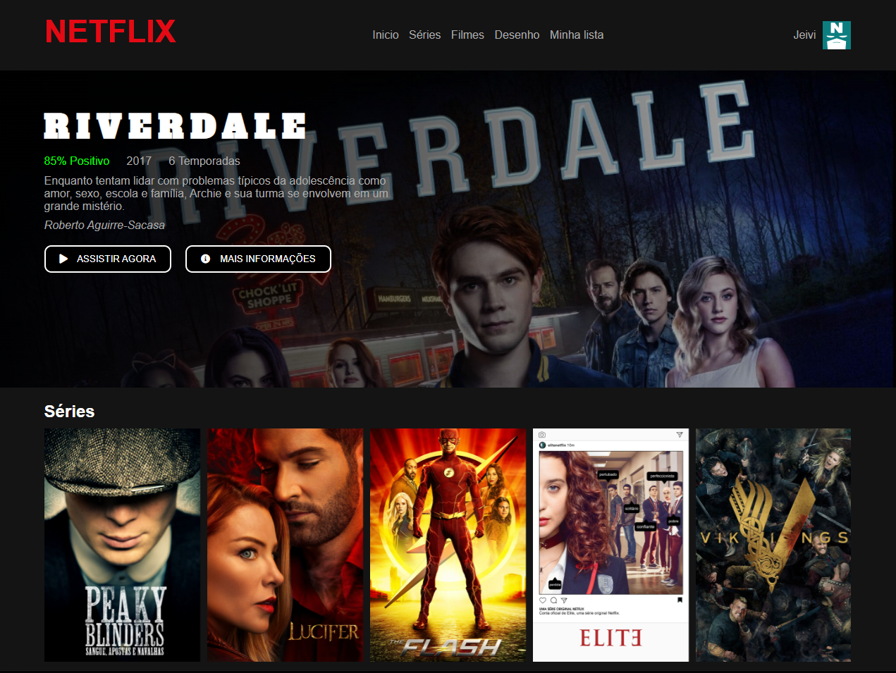

# Clone - Interface do NetFlix

## 🗒 Descrição do projeto
Recriando a interface do Netflix, desafio de projeto da **DIO** *(Digital Innovation One)*.
**Desafio:** *Recrie a interface do principal site de streaming mundial utilizando tecnologias simples como HTML5, css3 e JavaScript.*

## 🛠 Tecnologias usadas
- [HTML](https://developer.mozilla.org/en-US/docs/Web/HTML)
- [CSS](https://developer.mozilla.org/en-US/docs/Web/CSS)
- [JAVASCRIPT](https://developer.mozilla.org/en-US/docs/Web/JavaScrip)
- [OWL CAROUSEL](https://owlcarousel2.github.io/OwlCarousel2/demos/demos.html)
- [JQUERY](https://jquery.com/)

## 📷 Imagem do Projeto
